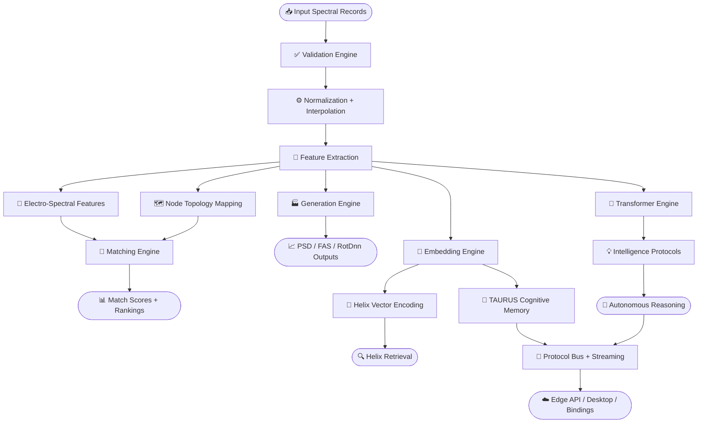

<div align="center">

# MESIE
## Multi-Element Spectral Intelligence Engine

**The Enterprise Spectral AI Platform**

[](https://opensource.org/licenses/Apache-2.0)
[](https://www.python.org/downloads/)
[](https://doi.org/10.5281/zenodo.20598320)
[](https://github.com/FreddyCreates/Multi-Element-Spectral-Intelligence-Engine-MESIE-/actions/workflows/ci.yml)
[](https://github.com/FreddyCreates/Multi-Element-Spectral-Intelligence-Engine-MESIE-/actions/workflows/julia-sdk.yml)
[](https://github.com/FreddyCreates/Multi-Element-Spectral-Intelligence-Engine-MESIE-/actions/workflows/publish.yml)
[](https://github.com/FreddyCreates/Multi-Element-Spectral-Intelligence-Engine-MESIE-/actions/workflows/deploy-mesie-api.yml)
[](https://github.com/FreddyCreates/Multi-Element-Spectral-Intelligence-Engine-MESIE-)
[](deliverables/MESIE_Monte_Carlo_Enterprise_Report.md)
[](deliverables/MESIE_Monte_Carlo_Enterprise_Report.md)

[📚 Documentation](#documentation) • [🚀 Quick Start](#quick-start) • [🔬 Research](#why-mesie) • [📦 Install](#installation)

</div>

---

## 🎯 Overview

MESIE is an enterprise-grade, open-source Python framework for multi-component spectral intelligence. We transform raw spectral data into **structured computational objects** with AI-native embeddings, transformer pipelines, autonomous reasoning, and cognitive integration.

### Core Capabilities

✨ **Spectral Processing**
- Single & multi-component spectral matching
- PSD & FAS-compatible generation
- Multi-level spectral validation (6 levels)
- Resonance & coherence scoring

🧠 **Intelligent Systems**
- AI-native embedding generation
- Transformer-based spectral pipelines
- Autonomous reasoning protocols (5 intelligence levels)
- Cognitive architecture integration

🔄 **Advanced Features**
- Helix vector encoding & hierarchical retrieval
- Real-time spectral streaming & protocols
- Cross-domain transfer learning
- Miniverse nesting & recursive containment
- Foundation model pretraining

---

## 🚀 Quick Start

### Installation

```bash
pip install mesie
```

For full scientific stack (scipy, pandas, scikit-learn, networkx):
```bash
pip install mesie[full]
```

For ML & transformers:
```bash
pip install mesie[ml]
```

For AI intelligence protocols:
```bash
pip install mesie[intelligence]
```

### Basic Usage

```python
from mesie import load_record, validate_record, match_records

reference = load_record("reference.json")
candidate = load_record("candidate.json")

report = validate_record(reference)
result = match_records(reference, candidate)

print(f"Match Score: {result.composite_score:.3f}")
```

---

## 📊 Enterprise Validation

**MESIE is validated across 10 enterprise verticals with 5,000 stochastic trials**

| Industry | Use Case | Result |
|----------|----------|--------|
| Manufacturing | Predictive maintenance | ✅ 100% |
| Energy | Grid & power systems | ✅ 100% |
| Aerospace | Satellite & orbital systems | ✅ 100% |
| Insurance | Catastrophe & seismic risk | ✅ 100% |
| Construction | Structural FAS analysis | ✅ 100% |
| Healthcare | Device monitoring | ✅ 100% |
| Robotics | Fleet state lookup | ✅ 100% |
| Telecom | Spectrum compliance | ✅ 100% |
| Research | Lab classification | ✅ 100% |
| Enterprise AI | Agent memory systems | ✅ 100% |

**→ [Full Monte Carlo Report](deliverables/MESIE_Monte_Carlo_Enterprise_Report.md)**

---

## 🧠 Core Features

MESIE supports:

- ✅ Single & multi-component spectral records
- ✅ RotDnn, PSD & FAS-compatible generation
- ✅ Multi-level spectral validation (6 levels)
- ✅ Resonance & coherence scoring
- ✅ Spectral feature extraction & frequency-domain matching
- ✅ AI-native embedding generation
- ✅ Intelligence protocols with autonomous reasoning
- ✅ Transformer-based spectral pipelines
- ✅ Helix vector encoding & hierarchical retrieval
- ✅ Spectral data protocols & real-time streaming
- ✅ AI system integration & pipeline orchestration
- ✅ Foundation model pretraining (Masked Spectral Modeling, InfoNCE, Temporal Prediction)
- ✅ 3D connectome brain environment (44 brain regions, 68 biologically-inspired connections)
- ✅ Miniverse nesting (recursive containment, scale-bridging, downward attention)

---

## 💡 Why MESIE?

**Problem:** Most spectral tools treat spectra as arrays.

**Solution:** MESIE treats spectra as **structured computational objects** with:
- Components, metadata & lineage tracking
- AI-ready embeddings
- Multi-scale feature extraction
- Memory integration

### Applicable To:
🏗️ Structural engineering • 🌍 Earthquake science • 🤖 Robotics • 🧠 Neuroscience • 🏥 Healthcare • 🔬 Research • 🤖 AI Systems

---

## 📥 Installation

**Standard Installation:**
```bash
pip install mesie
```

**With Full Scientific Stack** (scipy, pandas, scikit-learn, networkx):
```bash
pip install mesie[full]
```

**With ML & Transformers:**
```bash
pip install mesie[ml]
```

**With AI Intelligence Protocols:**
```bash
pip install mesie[intelligence]
```

**For Development:**
```bash
pip install -e ".[dev,full]"
```

---

## 🖥️ Desktop Application

MESIE includes a **cross-platform Electron UX** with spectral visualization, real-time validation, and Monte Carlo benchmarking:

<!-- ═══════════════════════════  L O G O  ══════════════════════════════ -->

```
███╗   ███╗███████╗███████╗██╗███████╗
████╗ ████║██╔════╝██╔════╝██║██╔════╝
██╔████╔██║█████╗  ███████╗██║█████╗
██║╚██╔╝██║██╔══╝  ╚════██║██║██╔══╝
██║ ╚═╝ ██║███████╗███████║██║███████╗
╚═╝     ╚═╝╚══════╝╚══════╝╚═╝╚══════╝
```

### Multi-Element Spectral Intelligence Engine

**The open-source science foundation model for spectral intelligence.**
*Treat every spectrum as a structured computational object — not just an array.*

<br/>

<!-- ══════════════════════════  B A D G E S  ═══════════════════════════ -->

<!-- Status -->
[](https://github.com/FreddyCreates/Multi-Element-Spectral-Intelligence-Engine-MESIE-/actions/workflows/ci.yml)
[](https://github.com/FreddyCreates/Multi-Element-Spectral-Intelligence-Engine-MESIE-/actions/workflows/publish.yml)
[](https://github.com/FreddyCreates/Multi-Element-Spectral-Intelligence-Engine-MESIE-/actions/workflows/julia-sdk.yml)
[](https://github.com/FreddyCreates/Multi-Element-Spectral-Intelligence-Engine-MESIE-/actions/workflows/deploy-mesie-api.yml)

<!-- Identity -->
[](https://github.com/FreddyCreates/Multi-Element-Spectral-Intelligence-Engine-MESIE-/releases)
[](https://opensource.org/licenses/Apache-2.0)
[](https://doi.org/10.5281/zenodo.20598320)

<!-- Python -->
[](https://www.python.org/downloads/)
[](https://www.python.org/downloads/)
[](https://www.python.org/downloads/)
[](https://www.python.org/downloads/)

<!-- Stack -->
[](https://numpy.org/)
[](https://scipy.org/)
[](https://scikit-learn.org/)
[](https://pytorch.org/)
[](https://huggingface.co/)
[](https://networkx.org/)
[](https://pandas.pydata.org/)

<!-- Polyglot -->
[](bindings/julia/)
[](bindings/)
[](bindings/)
[](bindings/)

<!-- Deployment -->
[](workers/mesie-api/)
[](mesie-desktop/)
[](scripts/)

<!-- Platform -->
[](https://github.com/FreddyCreates/Multi-Element-Spectral-Intelligence-Engine-MESIE-)
[](https://github.com/FreddyCreates/Multi-Element-Spectral-Intelligence-Engine-MESIE-)
[](https://github.com/FreddyCreates/Multi-Element-Spectral-Intelligence-Engine-MESIE-)

<!-- Quality -->
[](deliverables/MESIE_Monte_Carlo_Enterprise_Report.md)
[](deliverables/MESIE_Monte_Carlo_Enterprise_Report.md)
[](tests/)
[](https://peps.python.org/pep-0008/)

<!-- Research -->
[](docs/papers/)
[](https://doi.org/10.5281/zenodo.20598320)
[](CITATION.cff)
[](https://opensource.org/)

<!-- Community -->
[](https://github.com/FreddyCreates/Multi-Element-Spectral-Intelligence-Engine-MESIE-/stargazers)
[](https://github.com/FreddyCreates/Multi-Element-Spectral-Intelligence-Engine-MESIE-/forks)
[](https://github.com/FreddyCreates/Multi-Element-Spectral-Intelligence-Engine-MESIE-/issues)
[](CONTRIBUTING.md)

<br/>

---

**[Quick Start](#quick-start)** · **[Installation](#installation)** · **[Engines](#engines)** · **[Architecture](#architecture)** · **[Benchmarks](#enterprise-benchmark)** · **[Research](#research-papers)** · **[Citation](#citation)**

---

</div>

## What is MESIE?

**MESIE** (Multi-Element Spectral Intelligence Engine) is an open-source **science foundation model** for frequency-domain intelligence. Where most tools treat spectra as arrays of numbers, MESIE treats them as **structured computational objects** — records with components, metadata, lineage, derived features, embeddings, and reasoning primitives.

MESIE provides a complete scientific AI stack:

> 📥 Raw signal → ✅ Validation → 📐 Feature extraction → 🧬 Embedding → 🤖 Transformer reasoning → 🌐 Cross-domain transfer → 🧠 Connectome simulation → 📡 Edge deployment

It is built for scientists, engineers, and AI researchers working at the intersection of **signal processing**, **machine learning**, and **cognitive architectures**.

---

## Capabilities at a Glance

| Engine | What It Does |
|---|---|
| 🔬 **Spectral Processing** | Multi-component PSD / FAS / RotDnn / single-component records with full lineage |
| ✅ **Validation Engine** | 6-level hierarchical validation (file → spectral → component → format → embedding) |
| 📐 **Feature Engine** | Electro-spectral signatures, resonance peaks, coherence scores, band energy profiles |
| 🔗 **Matching Engine** | Multi-metric composite scoring with topology-aware comparison and ranking |
| 🧬 **Embedding Engine** | Resonance-aware spectral vectors for AI retrieval, clustering, and memory |
| 🤖 **Transformer Engine** | Multi-head spectral attention, configurable tokenization, sinusoidal positional encoding |
| 🧠 **Foundation Pretraining** | Masked Spectral Modeling · InfoNCE Contrastive Learning · Temporal Prediction |
| 🌐 **Transfer Engine** | CORAL + MMD cross-domain alignment across seismic, EEG, EM, acoustic, structural |
| 💡 **Intelligence Engine** | Passive → Reactive → Adaptive → Predictive → Autonomous reasoning protocols |
| 🧩 **Connectome Engine** | 44 brain regions · 68 white-matter tracts · ~6 mm/ms signal propagation |
| 💾 **TAURUS Memory** | Temporal, attention-weighted long-term and working memory with decay |
| 🧩 **NeuroCores** | Self-contained neural processing units with attention + memory + multi-scale analysis |
| 🐙 **Octopus Controller** | 8-arm multi-engine orchestrator (sense, embed, match, move, control, workflow, logic, memory) |
| 🔁 **Protocol Streaming** | Real-time spectral data protocols, MSGPACK serialization, inter-engine bus |
| 🔬 **Experiment Engine** | Hyperparameter search, cross-validation, bootstrap CI, paired t-tests |
| 🖥️ **Desktop App** | Cross-platform Electron GUI — visualization, validation, Monte Carlo |
| ☁️ **Edge API** | Cloudflare Worker serverless validate/match API |
| 🔌 **Polyglot Bindings** | Rust · Julia · TypeScript · Motoko (Internet Computer) |

---

## Quick Start

```bash
pip install mesie
```

```python
from mesie import load_record, validate_record, match_records

reference = load_record("reference.json")
candidate = load_record("candidate.json")

report = validate_record(reference)       # 6-level validation
result = match_records(reference, candidate)

print(result.composite_score)
print(result.metric_breakdown)
```

---

## Installation

```bash
# ── Core ── NumPy only, zero extra dependencies
pip install mesie

# ── Full scientific stack ── scipy, pandas, scikit-learn, networkx
pip install mesie[full]

# ── ML extras ── transformers + torch (skipped on Windows ARM64)
pip install mesie[ml]

# ── Full AI / intelligence protocols ──
pip install mesie[intelligence]

# ── AI connectors and bridge libraries ──
pip install mesie[ai]

# ── Julia bindings ──
pip install mesie[julia]

# ── Development ──
pip install -e ".[dev,full]"
```

### Platform Support Matrix

| Platform | Core | Full | ML / Intelligence | Desktop | Edge API |
|---|---|---|---|---|---|
| Linux x64 | ✅ | ✅ | ✅ | ✅ | ✅ |
| macOS x64 / ARM | ✅ | ✅ | ✅ | ✅ | ✅ |
| Windows x64 | ✅ | ✅ | ✅ | ✅ | via WSL |
| Windows ARM64 | ✅ | ✅ | ⚠️ CPU-only | ✅ | via WSL |

---

## Engines

MESIE is organized as a family of **engines** — independent, composable processing modules that work together through a unified protocol bus.

### 🔬 Validation Engine — 6-Level Spectral Quality Gate

```python
from mesie import load_record, validate_record

record = load_record("signal.json")
report = validate_record(record)

# Level 1: File integrity
# Level 2: Schema compliance
# Level 3: Component completeness
# Level 4: Spectral format compliance (PSD/FAS/RotDnn)
# Level 5: Embedding readiness
# Level 6: Enterprise-grade quality (clip, units, range)
print(report.level)          # 1–6
print(report.passed)         # True / False
print(report.issues)         # list of violation descriptions
```

---

### 🔗 Matching Engine — Multi-Metric Composite Scoring

```python
from mesie import load_record, match_records

reference = load_record("reference.json")
candidate = load_record("candidate.json")

result = match_records(reference, candidate)
print(f"Composite score:  {result.composite_score:.4f}")
print(f"Metric breakdown: {result.metric_breakdown}")
# → frequency overlap, amplitude correlation, resonance alignment, coherence delta
```

---

### 🏭 Generation Engine — PSD / FAS / RotDnn Synthesis

```python
from mesie import generate_psd, generate_fas
from mesie.core.config import GenerationConfig

config = GenerationConfig(seed=42, amplitude_shape="power_law")
psd    = generate_psd(config)
fas    = generate_fas(config)
```

---

### 🧬 Embedding Engine — Resonance-Aware Spectral Vectors

```python
from mesie.embeddings import SpectralVectorizer

vectorizer = SpectralVectorizer()
embedding  = vectorizer.fit_transform(record)
# → fixed-size vector preserving resonance structure, coherence, and band energy
```

---

### 🤖 Transformer Engine — Multi-Head Spectral Attention

End-to-end transformer encoder optimized for spectral sequences. Implemented in pure NumPy; optional PyTorch/HuggingFace acceleration via `[intelligence]`.

```python
from mesie import SpectralTransformerPipeline, TransformerConfig, SpectralTokenizer
import numpy as np

config   = TransformerConfig(d_model=128, n_heads=8, n_layers=6, pooling="mean")
pipeline = SpectralTransformerPipeline(config)

output = pipeline.forward(np.random.randn(512))
print(f"Embedding shape:  {output.embedding.shape}")
print(f"Attention layers: {len(output.attention_maps)}")

# Tokenization strategies: frequency_bins | wavelets | patches
tokenizer = SpectralTokenizer(method="frequency_bins", n_tokens=64)
tokens    = tokenizer.tokenize(np.random.randn(512))
```

**Built-in interpretability** — analyze what the model attends to at every layer:

```python
analysis = pipeline.get_attention_analysis(np.random.randn(128))
# → {n_layers, layer_analyses: [{attention_entropy, max_attention, attention_sparsity}]}
```

| Metric | What It Tells You |
|---|---|
| `attention_entropy` | How distributed vs. focused the model's attention is |
| `max_attention` | Strength of the dominant attended-to frequency token |
| `attention_sparsity` | Fraction of near-zero weights — how selective the model is |

---

### 🧬 Helix Vector Engine — Helical Geometry Retrieval

Hierarchical spectral encoding using helical geometry for high-speed approximate nearest-neighbor retrieval:

```python
from mesie import VectorHelix, HelixConfig, HelixRetriever
import numpy as np

helix   = VectorHelix(HelixConfig(dimensions=64, turns=8))
encoded = helix.encode(np.random.randn(256))

retriever = HelixRetriever()
results   = retriever.search(query=encoded, top_k=10)
```

---

### 🧠 Foundation Pretraining Engine

Three self-supervised objectives for large-scale spectral pretraining — the core of MESIE's foundation model capabilities:

| Objective | Masking Strategy | Description |
|---|---|---|
| **Masked Spectral Modeling** | Random · Contiguous · Band | Predict held-out spectral content from context |
| **InfoNCE Contrastive Learning** | — | Noise · frequency masking · amplitude scaling · circular shifts |
| **Temporal Prediction** | Weighted · Mean · Last · Concat | Predict future spectral state from history |

---

### 🌐 Cross-Domain Transfer Engine

MESIE's **spectral brain** generalizes across wildly different physical domains using CORAL alignment and MMD minimization:

| Source Domain | Target Domain | Transfer Path |
|---|---|---|
| Earthquake Harmonics | Bridge Vibration Anomalies | Seismic → Structural |
| EEG Neural Oscillations | Audio Resonance Detection | Neural → Acoustic |
| Electromagnetic / RF | Optical Spectroscopy | EM → Optical |
| Climate Atmospheric | Financial Time Series | Cyclic → Market |

```python
from mesie.cognitive import TransferLearningPipeline, SpectralDomain

pipeline = TransferLearningPipeline(shared_dim=64)
pipeline.initialize_with_synthetic(n_samples=1000, n_features=256)

# Evaluate a specific transfer path
result = pipeline.evaluate_transfer(
    SpectralDomain.SEISMIC,
    SpectralDomain.STRUCTURAL_VIBRATION,
    method="coral"   # "coral" | "mmd" | "combined"
)
print(f"Transfer efficiency: {result['transfer_efficiency']:.3f}")
print(f"MMD before → after:  {result['mmd_before']:.4f} → {result['mmd_after']:.4f}")

# Auto-discover the optimal strategy
strategy = pipeline.find_optimal_transfer_strategy(
    SpectralDomain.ELECTROMAGNETIC, SpectralDomain.AUDIO_ACOUSTIC
)
print(f"Best method: {strategy['best_method']}")
```

**What makes MESIE a foundation model:**

| Property | How MESIE Implements It |
|---|---|
| Generalization across domains | A model trained on earthquakes transfers to bridge vibrations |
| Domain-invariant representations | CORAL whitening + MMD minimization in shared latent space |
| Multi-hop transfer | Distant domains linked through intermediate spectral spaces |
| Automatic domain discovery | Similarity graphs expose compatible transfer paths |

---

### 💡 Intelligence Engine — Autonomous Spectral Reasoning

Five levels of autonomous behavior — configure exactly how much initiative the engine takes:

```python
from mesie import IntelligenceProtocol, IntelligenceConfig, IntelligenceLevel, ReasoningStrategy
import numpy as np

config   = IntelligenceConfig(
    level=IntelligenceLevel.ADAPTIVE,
    memory_capacity=500,
    attention_heads=8,
)
protocol = IntelligenceProtocol(config)
result   = protocol.reason(np.random.randn(256), strategy=ReasoningStrategy.ENSEMBLE)

print(f"Conclusion:          {result.conclusion}")
print(f"Confidence:          {result.confidence:.3f}")
print(f"Evidence:            {result.evidence}")
print(f"Recommended actions: {result.recommended_actions}")
```

| Level | Behavior |
|---|---|
| `Passive` | Observe and record — no autonomous action |
| `Reactive` | Respond to detected anomalies |
| `Adaptive` | Learn from patterns, update internal state |
| `Predictive` | Anticipate future spectral states |
| `Autonomous` | Full self-directed reasoning and action |

**Reasoning strategies:**

| Strategy | Method |
|---|---|
| `STATISTICAL` | Parametric statistics over spectral distributions |
| `PATTERN_MATCH` | Template-matching against learned spectral patterns |
| `ANOMALY` | Isolation and scoring of spectral outliers |
| `CAUSAL` | Causal inference over frequency-time relationships |
| `ENSEMBLE` | All strategies combined with confidence weighting |

---

### 🧩 Connectome Engine — 3D Brain Simulation

MESIE's **NeuroAIX** engine simulates spectral cognition inside an anatomically grounded 3D brain:

- **44 real brain regions** with MNI 3D coordinates across 10 functional systems
- **68 biologically-inspired white-matter tract connections**
- **~6 mm/ms signal propagation** with conduction delays
- Global coherence metrics and system-level activation tracking
- Full 3D state export for visualization

```python
# examples/08_3d_connectome_brain.py
from mesie.connectome import ConnectomeEngine

engine = ConnectomeEngine()
engine.inject(spectral_embedding, region="hippocampus")
state  = engine.propagate(steps=50)
print(state.global_coherence)
print(state.active_systems)
```

---

### 💾 TAURUS Memory Engine

**T**emporal **A**daptive **R**etrieval and **U**nified **S**torage — persistent, attention-weighted spectral memory:

```python
from mesie.cognitive import TaurusMemoryStore, TaurusWorkingMemory
import numpy as np

# Long-term memory: temporal decay + importance-weighted retrieval
store = TaurusMemoryStore(capacity=1000)
store.store(embedding=np.random.randn(128), context={"source": "sensor_A"}, importance=0.9)
results = store.retrieve(query=np.random.randn(128), top_k=5)

# Working memory: auto-promotes to long-term when capacity exceeded
working = TaurusWorkingMemory(capacity=7, long_term_store=store)
working.hold(embedding=np.random.randn(128), semantic_tag="transient")
```

---

### 🧩 NeuroCore Engine — Spectral Neural Processing Units

Self-contained neural processing units combining attention, TAURUS memory, and multi-scale spectral analysis:

```python
from mesie.cognitive import SpectralNeuroCore, NeuroCoreCluster, NeuroCoreConfig
import numpy as np

# Single core
core     = SpectralNeuroCore(NeuroCoreConfig(d_model=128, n_attention_heads=8))
result   = core.process(np.random.randn(256))
analysis = core.get_attention_analysis()
# → {mean_entropy, mean_max_attention, mean_sparsity, memory_analysis}

# Multi-core ensemble
cluster            = NeuroCoreCluster(n_cores=4)
ensemble_embedding = cluster.get_ensemble_embedding(np.random.randn(256))
```

---

### 🔌 AI System Integration Engine

Connect MESIE to external AI systems and orchestrate complex, parallelizable multi-stage pipelines:

```python
from mesie import AISystemConnector, ConnectorConfig, PipelineOrchestrator, OrchestratorConfig

# Connect and predict
connector   = AISystemConnector(ConnectorConfig(endpoint="local", batch_size=32))
predictions = connector.predict(embeddings)

# Multi-stage parallel pipeline
orchestrator = PipelineOrchestrator(OrchestratorConfig(
    stages=["validate", "extract", "embed", "reason"],
    parallel=True,
))
result = orchestrator.run(records)
```

---

### 📡 Protocol & Streaming Engine

Standardized spectral data protocols for interoperability, real-time streaming, and multi-format serialization:

```python
from mesie import SpectralDataProtocol, StreamingProtocol, SpectralSerializer, SerializationFormat

# Protocol messages
protocol = SpectralDataProtocol()
message  = protocol.create_message(record, metadata={"source": "sensor_array_1"})

# Real-time streaming
stream = StreamingProtocol(buffer_size=1024)
stream.push(spectrum_chunk)

# Multi-format serialization: JSON | MSGPACK | binary
serializer = SpectralSerializer(format=SerializationFormat.MSGPACK)
payload    = serializer.encode(record)
```

---

### 📊 Experiment Engine — Scientific Rigor at Scale

```python
from mesie.cognitive import ExperimentPipeline, StatisticalTestSuite

# Hyperparameter optimization with cross-validation
pipeline = ExperimentPipeline(
    name="spectral_classification",
    search_space={
        "lr":     {"type": "float", "range": [0.001, 0.1], "log": True},
        "layers": {"type": "int",   "range": [1, 8]},
    }
)
result = pipeline.optimize(data, labels, n_trials=50)

# Statistical validation
stats      = StatisticalTestSuite()
ci         = stats.bootstrap_ci(scores, n_bootstrap=1000)
comparison = stats.paired_t_test(method_a_scores, method_b_scores)
```

---

## 🔄 Cross-Domain Spectral Transfer



### Package Layout

```
mesie/
├── core/          — MultiElementRecord, SpectralComponent, MatchResult, GenerationConfig
├── io/            — Loading from JSON, CSV, arrays, DataFrames; export
├── processing/    — Normalization, interpolation, band-pass smoothing
├── matching/      — Composite scoring, frequency overlap, amplitude correlation
├── generation/    — PSD, FAS, RotDnn, single-component synthetic generation
├── features/      — Electro-spectral signatures, resonance peaks, coherence, band energy
├── topology/      — Node mapping, lineage tracking, component graph
├── embeddings/    — SpectralVectorizer, resonance-aware vector encoding
├── cognitive/     — TAURUS memory, NeuroCores, cross-domain transfer, experiment engine
├── ai/            — Transformer pipeline, intelligence protocols, training, transfer
├── protocols/     — SpectralDataProtocol, StreamingProtocol, multi-format serialization
├── integration/   — AISystemConnector, PipelineOrchestrator, library bridges
├── helix/         — VectorHelix, HelixConfig, HelixRetriever
├── pretraining/   — Foundation objectives, observation encoder, digital twin, spectral memory
├── connectome/    — 3D NeuroAIX brain (44 regions, 68 tracts, MNI coordinates)
├── internal_api/  — Cross-engine communication bus (9 processing engines)
├── library/       — User spectral corpus loader, MAESI SDK
├── validation/    — 6-level validation pipeline
└── visualization/ — Spectral plotting, attention maps, connectome 3D export
```

---

## Deployment

### 🖥️ Desktop Application (Electron)

Cross-platform GUI with spectral visualization, real-time validation, and Monte Carlo benchmarking:

```bash
cd mesie-desktop && npm install && npm start   # production
npm run dev                                     # development + DevTools
npm run build:win                               # Windows installer
npm run build:mac                               # macOS .dmg
npm run build:linux                             # Linux AppImage / deb
```

See [mesie-desktop/README.md](mesie-desktop/README.md).

---

### ☁️ Cloudflare Worker Edge API

Serverless spectral validate / match API deployed globally at the edge:

```bash
cd workers/mesie-api
npm install
npx wrangler login
npm run deploy
```

```
POST /validate  — validate a spectral record (returns level 1–6 report)
POST /match     — compare two records (returns composite score + breakdown)
```

See [workers/mesie-api/README.md](workers/mesie-api/README.md). Local `wrangler dev` requires x64 — use WSL on Windows ARM.

---

### 🖲️ PowerShell Module

Cross-platform wrapper (Windows PowerShell 5.1+ / PowerShell Core 7+):

```powershell
Import-Module ./scripts/MESIE.psm1

Test-MESIEInstall                                                        # verify environment
Invoke-MESIEValidate   -RecordPath "data/reference/vibration.json"       # validate a record
Invoke-MESIEGenerate   -Type psd -Seed 42                                # generate PSD
Invoke-MESIEMonteCarlo -Trials 500                                       # run benchmark
Search-MESIEResearch   -Query "spectral analysis" -TopK 5                # search catalog
Start-MESIEDesktop     -Dev                                              # launch desktop app
```

---

### 🔌 Polyglot Bindings

| Language | Location | Notes |
|---|---|---|
| **Julia** | `bindings/julia/ZenodoSpectralSDK/` | Full SDK, `juliacall` bridge |
| **TypeScript** | `bindings/` | npm-compatible bindings |
| **Rust** | `bindings/` | FFI bindings |
| **Motoko** | `bindings/` | Internet Computer (ICP) canister |

---

## Enterprise Benchmark

MESIE is validated across **10 enterprise verticals** via **5,000 stochastic Monte Carlo trials** (500 per vertical, independently seeded):

| # | Industry | Use Case | Trials | Result |
|---|---|---|---|---|
| 1 | 🏭 Manufacturing | Predictive maintenance — vibration drift detection | 500 | ✅ **100%** |
| 2 | ⚡ Energy | Grid & power — Schumann/EM signals under noise | 500 | ✅ **100%** |
| 3 | 🚀 Aerospace | Satellite / orbital edge + seismic anchor | 500 | ✅ **100%** |
| 4 | 🛡️ Insurance | Catastrophe / seismic risk cross-matching | 500 | ✅ **100%** |
| 5 | 🏗️ Construction | Structural FAS ranking under perturbation | 500 | ✅ **100%** |
| 6 | 🏥 Healthcare | Device monitoring — anomaly vs. baseline | 500 | ✅ **100%** |
| 7 | 🤖 Robotics | Fleet ANN spectral state lookup | 500 | ✅ **100%** |
| 8 | 📡 Telecom | Spectrum compliance (research + EM libraries) | 500 | ✅ **100%** |
| 9 | 🔬 Research | R&D lab benchmark classification | 500 | ✅ **100%** |
| 10 | 🧠 Enterprise AI | Agent spectral memory (MAESI + fingerprint) | 500 | ✅ **100%** |

> 🏆 **5,000 / 5,000 trials passed · Enterprise grade (≥ 85%): PASS · Runtime: ~8 s**

```bash
# Quick benchmark  (2,000 trials)
python scripts/monte_carlo_enterprise_benchmark.py --trials 200

# Full enterprise  (5,000 trials)
python scripts/monte_carlo_enterprise_benchmark.py --trials 500

# Via pytest  (includes long workflow patterns)
pytest tests/test_enterprise_workflows.py -v
```

Full report: [deliverables/MESIE_Monte_Carlo_Enterprise_Report.md](deliverables/MESIE_Monte_Carlo_Enterprise_Report.md)

---

## Use-Case Matrix

| Domain | Workflow | MESIE Engines Used |
|---|---|---|
| Earthquake Engineering | Record → validate → match → rank | Validation · Matching · Generation |
| Structural Health Monitoring | Sensor stream → embed → anomaly detect | Embedding · Intelligence · TAURUS |
| Neuroscience | EEG → embed → connectome → coherence | Embedding · Connectome · NeuroCores |
| Robotics / Digital Twins | Joint spectra → state signature → ANN lookup | Embedding · Helix · TAURUS |
| Telecom Compliance | RF spectra → validate → cross-match | Validation · Matching · Feature |
| AI Agent Memory | Observation → embed → TAURUS → retrieve | Embedding · TAURUS · Intelligence |
| Foundation Pretraining | Corpus → MSM + InfoNCE + TP → checkpoint | Pretraining · Transformer · Embedding |
| Edge Deployment | Record → Cloudflare Worker → score | Edge API · Validation · Matching |

---

## Research Papers

MESIE is accompanied by a three-paper theoretical research series:

| # | Paper | Theme |
|---|---|---|
| [I](docs/papers/paper_I_de_spectris_mundi.md) | *De Spectris Mundi Cognoscentis* — On the Spectra of a Knowing World | Spectral Cognitive Substrate Theory: why frequency is the universal basis for intelligence |
| [II](docs/papers/paper_II_machina_cogitans.md) | *Machina Cogitans* — The Thinking Machine | Transformer architectures for spectral intelligence and autonomous reasoning |
| [III](docs/papers/paper_III_nexus_intelligentiae.md) | *Nexus Intelligentiae* — The Intelligence Nexus | Cross-domain transfer, the spectral foundation model, and multi-hop generalization |

**Research program:** [docs/research_program.md](docs/research_program.md)

**Core hypothesis:**
> *Spectral records are not merely measurement outputs. Properly encoded, they can serve as retrieval objects, clustering primitives, anomaly detectors, state comparators, simulation memories, and cognitive reasoning primitives inside autonomous agents.*

---

## Citation

If you use MESIE in your research, please cite:

```bibtex
@software{medina2026mesie,
  author    = {Medina, Alfredo},
  title     = {MESIE: Multi-Element Spectral Intelligence Engine},
  version   = {0.4.0},
  year      = {2026},
  publisher = {Zenodo},
  url       = {https://github.com/FreddyCreates/Multi-Element-Spectral-Intelligence-Engine-MESIE-},
  doi       = {10.5281/zenodo.20598320}
}
```

A `CITATION.cff` file is included in the repository root for automated citation tools.

---

## Contributing

We welcome contributions of all kinds — bug reports, documentation improvements, new features, and research ideas.

1. Fork the repository
2. Create a feature branch: `git checkout -b feature/your-feature`
3. Install dev dependencies: `pip install -e ".[dev,full]"`
4. Run the test suite: `pytest tests/`
5. Open a pull request

Please read [CONTRIBUTING.md](CONTRIBUTING.md) before submitting.

---

## Security

To report a security vulnerability, please open a GitHub issue with the `security` label or contact the maintainers directly. Do not include sensitive details in public issues.

---

## 📜 Citation

If you use MESIE in your research, please cite:

```bibtex
@software{medina2026mesie,
  author = {Medina, Alfredo},
  title = {MESIE: Multi-Element Spectral Intelligence Engine},
  version = {0.4.0},
  year = {2026},
  url = {https://github.com/FreddyCreates/Multi-Element-Spectral-Intelligence-Engine-MESIE-},
  doi = {10.5281/zenodo.20598320}
}
```

---

## 📄 License

Released under the **Apache 2.0** license. See [LICENSE](LICENSE) for full details.

You are free to use, modify, and distribute MESIE in commercial and non-commercial projects.

---

<div align="center">

**MESIE** · Multi-Element Spectral Intelligence Engine · v0.4.0

Built by [Alfredo Medina](https://github.com/FreddyCreates) and the MESIE Research Collective

[GitHub](https://github.com/FreddyCreates/Multi-Element-Spectral-Intelligence-Engine-MESIE-) · [Zenodo](https://doi.org/10.5281/zenodo.20598320) · [Research Papers](docs/papers/) · [Documentation](docs/)

*Apache 2.0 · Open Science · Open Source*

</div>
