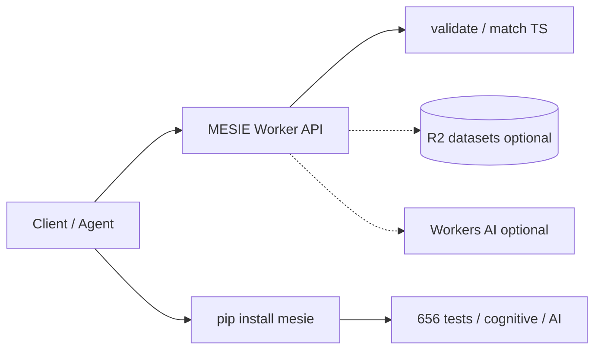

# Cloudflare Workers Expansion

MESIE can expose a global edge API via Cloudflare while the Python package remains the research-grade engine.

## Architecture

## Repository layout

- `workers/mesie-api/` — Wrangler project (`npm run dev` / `npm run deploy`)
- `docs/cloudflare.md` — this file

## Why two runtimes?

| Runtime | Strength |
|---------|----------|
| **Cloudflare Worker** | Global latency, auth at edge, HTTP API, no servers |
| **Python mesie** | Full validation ladder, generation, embeddings, cognitive stack |

Workers cannot run the full NumPy/Python stack natively. The edge API mirrors validate/match; heavy jobs stay in Python or future GPU backends.

## Deploy checklist

1. `cd workers/mesie-api && npm install`
2. `npx wrangler login`
3. `npm run deploy`
4. `npx wrangler secret put MESIE_API_KEY`
5. Point agents at `https://<worker>.workers.dev/v1/match`

See [workers/mesie-api/README.md](../workers/mesie-api/README.md).