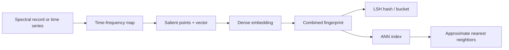

# Fingerprint pipeline: time-frequency → salient → LSH → ANN

MESIE implements the full lookup stack you described:



## 1. Time-frequency transform

| Input | Method |
|-------|--------|
| 1D time series | STFT (`scipy` if installed, else NumPy FFT) |
| Frequency-domain record | Pseudo-TF map (log bands × sliding spectral windows) |
| Optional | Synthetic signal from peaks → true STFT |

```python
from mesie.signal import TimeFrequencyTransform

tf = TimeFrequencyTransform().from_record(my_record)
# tf.matrix shape: (n_freq_rows, n_time_cols)
```

## 2. Salient feature extraction

Local maxima in the TF plane above a percentile threshold → **SalientPoint** list + fixed **128-d** landmark vector (32 points × 4).

```python
from mesie.signal import SalientFeatureExtractor

salient = SalientFeatureExtractor(max_points=32).extract(tf)
```

## 3. Embedding + LSH (compact lookup)

- **Dense**: existing `SpectralVectorizer` (17-D)
- **Combined**: L2-normalized `[salient || dense]`
- **LSH**: random hyperplane signatures (cosine LSH), hex + bucket key

```python
from mesie.embeddings import LSHHasher

sig = LSHHasher(dim=145, n_planes=16).hash(vector)
```

## 4. Approximate nearest neighbors

`ANNIndex` uses LSH buckets as a **pre-filter**, then exact cosine rerank on candidates.

```python
from mesie.embeddings import SpectralFingerprintPipeline

pipe = SpectralFingerprintPipeline()
pipe.index_records(corpus)
hits = pipe.query(query_record, top_k=5)
```

## Internal API engine

Registered as `fingerprint` on the bus:

- `process` — full fingerprint for one record
- `index` — batch index
- `query` — ANN search
- `explain` — salient + LSH bucket comparison

## Run demo

```bash
python examples/13_fingerprint_ann_pipeline.py
```

## Vector DB note

This is an in-process vector store (NumPy + LSH). For production scale, export `combined_vector` + `lsh_bucket` to FAISS, Milvus, or pgvector — same embedding layout.