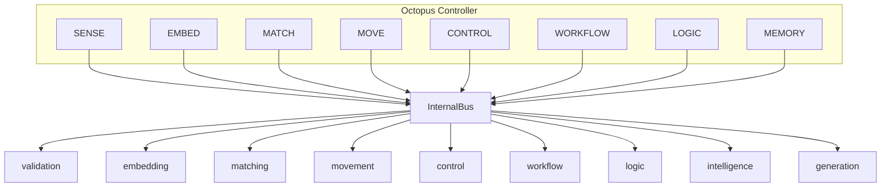

# Octopus engineering & internal API

MESIE now exposes **nine engines** on an **internal message bus**. The **Octopus controller** coordinates eight **arms** for sensing, embedding, matching, movement, control, workflow, logic, and memory.

## Architecture



## Engines

| Engine | Role |
|--------|------|
| `embedding` | Vectorize, index, query, workflow fingerprints |
| `matching` | Compare and rank spectra |
| `generation` | PSD / FAS / RotDNN synthesis |
| `validation` | Schema and quality checks |
| `intelligence` | Reasoning and memory objects |
| `control` | Setpoints, modes, arm enable, evaluate commands |
| `movement` | Trajectory / phase progression (robotics metaphor) |
| `workflow` | Multi-step pipelines across engines |
| `logic` | Rules that fire downstream actions |

## Internal API

```python
from mesie.internal_api import InternalRouter

router = InternalRouter()
resp = router.call("embedding", "transform", {"record": my_record})
```

Messages use `MessageEnvelope` (topic, source, target, action, payload). The bus supports **request/response** and **broadcast**.

## Octopus arms

| Arm | Engine | Default action |
|-----|--------|----------------|
| SENSE | validation | validate |
| EMBED | embedding | transform |
| MATCH | matching | match |
| MOVE | movement | advance |
| CONTROL | control | status |
| WORKFLOW | workflow | status |
| LOGIC | logic | evaluate |
| MEMORY | intelligence | memory |

```python
from mesie.octopus import OctopusController

octopus = OctopusController()
report = octopus.run_standard_cycle(record, candidate=other_record)
print(report.plain_summary)
```

## Example

```bash
python examples/11_octopus_internal_api.py
```

## Your spectral library (EMBED arm)

```bash
python scripts/embed_my_library.py path/to/your/json_folder --octopus
```

Or point Octopus at a saved index:

```python
from mesie.octopus import OctopusController, OctopusConfig

octopus = OctopusController(
    config=OctopusConfig(user_index_path="library/my_spectral_index.json")
)
```

Bundled reference JSON (`frequencies`/`amplitudes` keys) is auto-normalized on load.

## Extending

1. Subclass `Engine` in `mesie/engines/`.
2. Register on `EngineRegistry` or `build_default_registry`.
3. Map a new `ArmId` in `mesie/octopus/arms.py` if it needs an octopus tentacle.