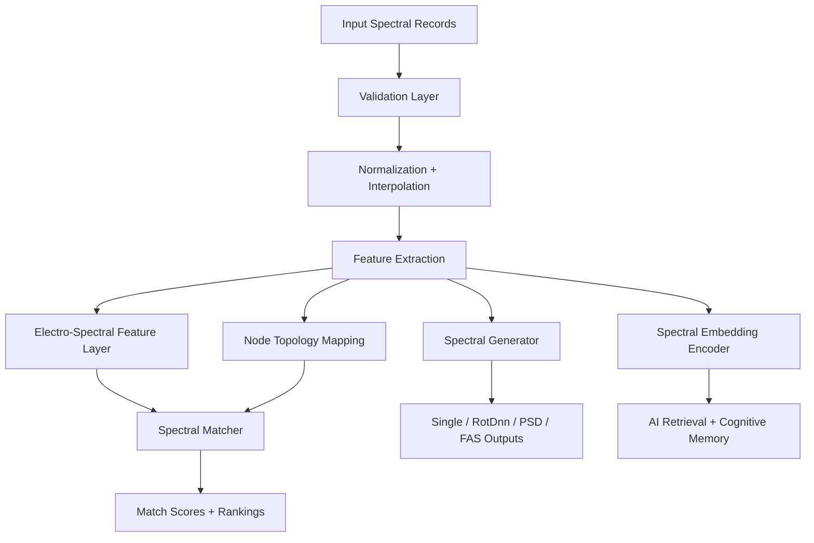

# MESIE System Architecture

```mermaid
flowchart TD
    A[Input Spectral Records] --> B[Validation Layer]
    B --> C[Normalization + Interpolation]
    C --> D[Feature Extraction]
    D --> E[Electro-Spectral Feature Layer]
    D --> F[Node Topology Mapping]
    E --> G[Spectral Matcher]
    F --> G
    G --> H[Match Scores + Rankings]
    D --> I[Spectral Generator]
    I --> J[Single / RotDnn / PSD / FAS Outputs]
    D --> K[Spectral Embedding Encoder]
    K --> L[AI Retrieval + Cognitive Memory]
```
