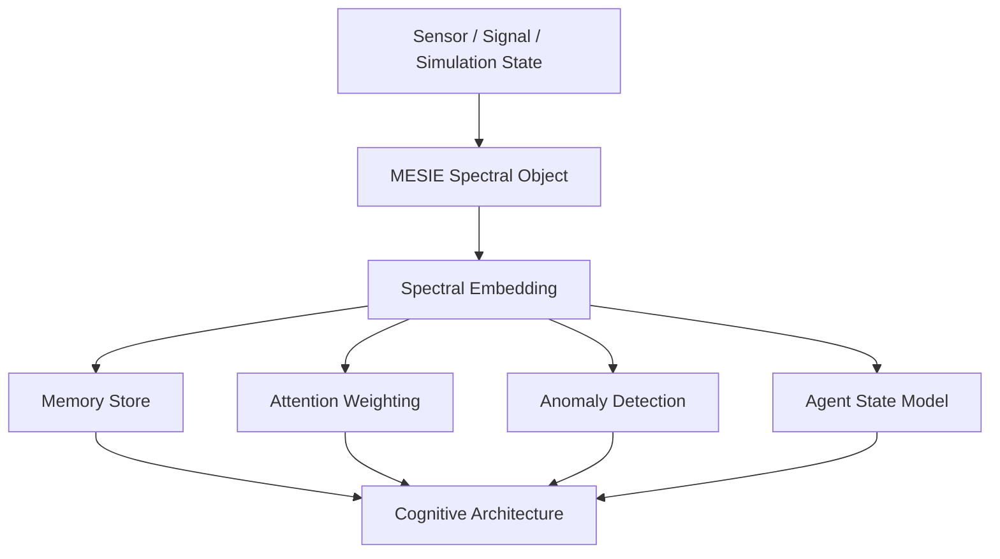

# Cognitive Architecture Integration



## Validation Ladder

```text
Level 1: File validity
Level 2: Spectral validity
Level 3: Component compatibility
Level 4: PSD/FAS/RotDnn compatibility
Level 5: Embedding-readiness
Level 6: Cognitive integration readiness
```
