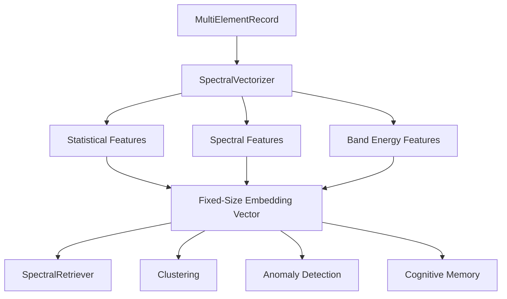

# Embedding Pipeline Detail

```mermaid
flowchart TD
    A[MultiElementRecord] --> B[SpectralVectorizer]
    B --> C[Statistical Features]
    B --> D[Spectral Features]
    B --> E[Band Energy Features]
    C --> F[Fixed-Size Embedding Vector]
    D --> F
    E --> F
    F --> G[SpectralRetriever]
    F --> H[Clustering]
    F --> I[Anomaly Detection]
    F --> J[Cognitive Memory]
```
