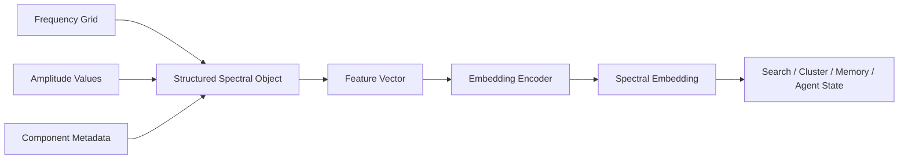

# Spectral Embedding Pipeline

```mermaid
flowchart LR
    A[Frequency Grid] --> D[Structured Spectral Object]
    B[Amplitude Values] --> D
    C[Component Metadata] --> D
    D --> E[Feature Vector]
    E --> F[Embedding Encoder]
    F --> G[Spectral Embedding]
    G --> H[Search / Cluster / Memory / Agent State]
```
